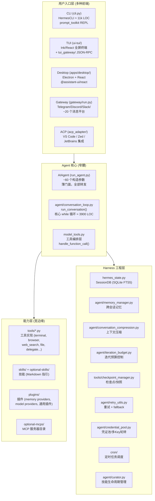

# Hermes Agent 架构分析

> 基于源码 `hermes-agent` (v0.18.0) 的架构解读。

---

## 一、CLI、TUI、Desktop 三种运行模式的入口

### 1. CLI 模式入口

```
用户执行: hermes (或 hermes chat)
    ↓
hermes_cli/main.py:main()         ← argparse 入口，解析子命令
    ↓
cli.py: HermesCLI 类              ← 交互式 REPL，约 11000 行
    ↓ (每轮用户输入)
run_agent.py: AIAgent.run_conversation()  → 转发到 agent/conversation_loop.py
```

- **`hermes_cli/main.py`** — 命令行入口，解析 `hermes chat` / `hermes gateway` / `hermes setup` 等所有子命令。在导入任何 Hermes 模块之前完成 profile override（`_apply_profile_override()`）和 TUI/CLI 模式判定（`_wants_tui_early()`）。
- **`cli.py`** — `HermesCLI` 类，基于 **prompt_toolkit** 构建的交互式 REPL，包含 Rich banner、KawaiiSpinner 动画、皮肤引擎（`hermes_cli/skin_engine.py`）、斜杠命令补全（`hermes_cli/commands.py`）等。

### 2. TUI 模式入口

```
用户执行: hermes --tui (或 HERMES_TUI=1)
    ↓
hermes_cli/main.py 检测 --tui 标志 → 启动两个进程:
    ├── Node.js (ui-tui/)  ← Ink (React) 全屏 TUI
    └── Python (tui_gateway/)  ← JSON-RPC 后端
        二者通过 stdin/stdout 用 newline-delimited JSON-RPC 通信
    ↓
ui-tui/src/entry.tsx            ← Node 侧入口
tui_gateway/server.py           ← Python 侧入口 (JSON-RPC server)
    ↓ (prompt.submit →)
run_agent.py: AIAgent.run_conversation()
```

- **`ui-tui/src/entry.tsx`** — 基于 Ink (React for terminal) 的全屏 TUI 渲染入口，负责终端模式重置、graceful exit、内存监控等。
- **`tui_gateway/server.py`** — JSON-RPC 服务端，管理 session、tools、slash 命令，调用 `AIAgent`。包含崩溃日志（`tui_gateway_crash.log`）和 panic hook。
- **进程模型**：Node 负责屏幕渲染（transcript、composer、activity），Python 负责 session/工具/模型调用。通过 `tui_gateway/transport.py` 的 `StdioTransport` 通信。

### 3. Desktop (Electron) 模式入口

```
用户启动: Hermes Desktop App
    ↓
apps/desktop/electron/main.cjs   ← Electron 主进程
    ↓ (spawn 子进程)
hermes serve (tui_gateway 后端)  ← 无头 JSON-RPC 后端
    ↓ (WebSocket JSON-RPC)
apps/desktop/src/main.tsx        ← React 渲染进程入口
    ↓
@assistant-ui/react 组件         ← 独立聊天 UI (非嵌入 --tui)
    ↓
apps/shared/ JsonRpcGatewayClient ← WebSocket 客户端与后端通信
```

- **`apps/desktop/electron/main.cjs`** — Electron 主进程（窗口管理、spawn 后端、native 能力、自动更新、git 操作等）。
- **`apps/desktop/src/main.tsx`** — React 渲染进程（使用 `@assistant-ui/react` 组件库，**独立于 TUI** 的另一套聊天界面）。
- **`apps/shared/`** — 共享包 `@hermes/shared`，提供 `JsonRpcGatewayClient` 和 WebSocket URL 工具。
- Desktop 复用 `tui_gateway` 作为后端，但前端是完全独立的 React 实现。斜杠命令通过 `apps/desktop/src/lib/desktop-slash-commands.ts` 进行客户端策展后分发到后端。

---

## 二、以 CLI 模式为例，Hermes 整体设计思路

Hermes 的设计核心可以用 AGENTS.md 中的一句话概括：

> **The core is a narrow waist; capability lives at the edges.**



### 设计理念拆解

| 层次 | 职责 | 关键约束 |
|------|------|----------|
| **用户入口层** | 多前端适配（CLI/TUI/Desktop/Gateway/ACP），每个前端有自己的交互范式 | 各自独立，通过 `AIAgent` 统一调用 |
| **核心层（窄腰）** | `run_conversation()` — 唯一的一个 while 循环统一所有前端 | 每轮 API 调用的 prompt **永远不变**（保证 cache 命中）；工具 schema 不变；不添加新核心工具 |
| **能力层（宽边缘）** | 工具(terminal/file/browser/search/delegate)、技能(skills.md)、插件(plugin.yaml)、MCP 服务器 | 通过"脚印阶梯"原则：尽量走 CLI 命令 + skill → service-gated tool → plugin → MCP → **最后才考虑核心工具** |
| **Harness 工程层** | Session 持久化、记忆管理、上下文压缩、预算控制、重试/fallback、凭证池、定时任务、技能策展 | 所有这些对 Agent 循环透明，但都是生产级 AI Agent 必不可少的工程支撑 |

### 两大神圣属性

1. **Per-conversation prompt caching is sacred.** 长对话每轮复用缓存的 prefix。任何修改历史上下文、中途切换 toolset、或重建 system prompt 的操作都会使缓存失效，成倍增加用户成本。唯一的例外是上下文压缩。
2. **The core is a narrow waist; capability lives at the edges.** 每个核心工具都会在每次 API 调用中发送，因此添加新核心工具的门槛极高。大多数新能力应以 CLI 命令 + skill、service-gated tool、或 plugin 的形式出现。

### 脚印阶梯 (The Footprint Ladder)

新能力的决策顺序（从最少脚印到最多）：

1. **扩展现有代码** — 零新表面
2. **CLI 命令 + skill** — 零模型工具脚印（默认选择）
3. **Service-gated tool (`check_fn`)** — 仅在满足前置条件时出现
4. **Plugin** — 第三方/利基/用户特定能力，不随核心发布
5. **MCP 服务器（目录中）** — 零永久核心 schema 脚印
6. **新核心工具** — 仅当能力是基础性的、对几乎所有用户都有用、且无法通过 terminal + file 实现时

---

## 三、Agent 循环的主体实现

Agent 循环的主体在 **`agent/conversation_loop.py`** 的 `run_conversation()` 函数中（约 3900 行），`run_agent.py` 中的 `AIAgent.run_conversation()` 只是一个薄转发器：

```python
# run_agent.py:5692
def run_conversation(self, ...):
    """Forwarder — see agent.conversation_loop.run_conversation."""
    from agent.conversation_loop import run_conversation
    return run_conversation(self, ...)
```

同样，`AIAgent.__init__` 也转发到 `agent/agent_init.py:init_agent()`。

### 核心循环结构

```
build_turn_context()          ← 每轮序幕：stdio 守护、消息清洗、
                                system prompt 构建/恢复、记忆预取、
                                压缩预检、插件 pre_llm_call hook
                                (agent/turn_context.py)

while (api_call_count < max_iterations 
       and budget.remaining > 0) 
       or budget_grace_call:
    │
    ├── 中断检查 (_interrupt_requested)
    ├── 预算消费 (iteration_budget.consume())
    ├── step_callback (gateway agent:step 事件)
    ├── /steer 消息注入 (预 API 调用 drain)
    │
    ├── 构建 api_messages:
    │   ├── 记忆上下文注入 (build_memory_context_block)
    │   ├── reasoning echo (multi-turn 推理保真)
    │   ├── prompt caching 注入 (cache_control 断点)
    │   ├── 消息序列修复 (角色交替违规修复)
    │   ├── thinking-only turn 清理
    │   ├── 消息规范化 (whitespace + JSON key 排序)
    │   └── surrogate 字符清理
    │
    ├── API 调用 (重试循环):
    │   ├── Nous rate limit 守卫 (agent/nous_rate_guard.py)
    │   ├── middleware 链 (hermes_cli/middleware.py)
    │   ├── pre_api_request 插件 hook
    │   ├── streaming 路径 (优先) / 非 streaming 路径
    │   ├── 错误分类 → 重试 / fallback / 压缩 / 中断
    │   │   (agent/error_classifier.py, agent/retry_utils.py)
    │   └── 成功 → assistant_message
    │
    ├── 如有 tool_calls:
    │   ├── execute_tool_calls_concurrent() 或
    │   │   execute_tool_calls_sequential()
    │   │   └── agent/tool_executor.py
    │   ├── 工具结果追加到 messages
    │   └── 继续循环
    │
    └── 如无 tool_calls → 结束循环 (final_response)

finalize_turn()               ← agent/turn_finalizer.py
    ├── 预算耗尽摘要
    ├── trajectory 保存
    ├── session 持久化 (SQLite)
    ├── 内存/技能后台审查触发
    └── 返回 result dict
```

### 关键设计决策

- **同步循环，单线程模型** — 整个 `while` 循环是同步的（虽然有异步工具调用的桥接，通过 `model_tools.py` 中的持久化 event loop）
- **Prompt caching 绝对不可破坏** — system prompt 只构建一次（`_cached_system_prompt`），每轮回放完全相同的字节
- **工具调用支持并发执行** — `execute_tool_calls_concurrent()` 用 `ThreadPoolExecutor` 并行执行独立工具
- **`_budget_grace_call` 机制** — 预算耗尽后给模型"最后一次发言机会"，避免截断
- **消息角色交替严格保证** — 绝不允许两个相同角色的消息连续出现，也绝不在循环中注入合成的 user 消息

---

## 四、围绕 Agent 循环的 Harness 工程

### 4.1 目录总览

| 目录 | 职责 | 关键文件 |
|------|------|----------|
| **`agent/`** | Agent 内部机制（~90 文件） | `conversation_loop.py`, `conversation_compression.py`, `memory_manager.py`, `iteration_budget.py`, `error_classifier.py`, `retry_utils.py`, `credential_pool.py`, `prompt_builder.py`, `prompt_caching.py`, `turn_context.py`, `turn_finalizer.py`, `tool_executor.py` |
| **`tools/`** | 工具实现 + 注册表（~100 文件） | `registry.py`, `terminal_tool.py`, `browser_tool.py`, `delegate_tool.py`, `file_tools.py`, `web_tools.py`, `checkpoint_manager.py` |
| **`gateway/`** | 消息网关（多平台接入） | `run.py`, `session.py`, `hooks.py`, `platforms/*.py` |
| **`tui_gateway/`** | TUI 的 Python JSON-RPC 后端 | `server.py`, `transport.py` |
| **`cron/`** | 定时任务调度 | `jobs.py`, `scheduler.py` |
| **`hermes_cli/`** | CLI 子命令、配置、插件发现 | `main.py`, `config.py`, `plugins.py`, `commands.py` |
| **`hermes_state.py`** | SessionDB — SQLite 会话存储 (FTS5 全文搜索) | — |
| **`model_tools.py`** | 工具编排层（连接 registry 和 agent） | — |
| **`toolsets.py`** | 工具集定义 | — |

### 4.2 按关注点分类的 Harness 组件

#### 🔄 生命周期 & 韧性

| 组件 | 文件 | 功能 |
|------|------|------|
| **Turn Context** | `agent/turn_context.py` | 每轮序幕：stdio 守护、消息清洗、system prompt 恢复/构建、记忆预取、压缩预检 |
| **Turn Finalizer** | `agent/turn_finalizer.py` | 每轮收尾：trajectory 保存、session 持久化、内存/技能审查触发 |
| **Iteration Budget** | `agent/iteration_budget.py` | 线程安全的迭代计数 + `_budget_grace_call` 机制 |
| **Checkpoint Manager** | `tools/checkpoint_manager.py` | 文件级快照/回滚 |
| **Process Bootstrap** | `agent/process_bootstrap.py` | 安全的 stdio 守护 |
| **Cron Scheduler** | `cron/scheduler.py` + `cron/jobs.py` | 定时任务调度（3 分钟硬中断、catchup 窗口、文件锁防重复） |

#### 🔁 重试 & 容错

| 组件 | 文件 | 功能 |
|------|------|------|
| **Error Classifier** | `agent/error_classifier.py` | API 错误分类 → 决定重试/fallback/中断 |
| **Retry Utils** | `agent/retry_utils.py` | 自适应 rate-limit backoff + jitter |
| **Turn Retry State** | `agent/turn_retry_state.py` | 每次 API 调用的重试状态机 |
| **Message Sanitization** | `agent/message_sanitization.py` | 修复 tool_call 参数损坏、消息角色交替违规、non-ASCII/surrogate 清理 |
| **Credential Pool** | `agent/credential_pool.py` + `credential_sources.py` + `credential_persistence.py` | 多 API Key 池、token 刷新、401 自动切换 |
| **Nous Rate Guard** | `agent/nous_rate_guard.py` | 跨 session 的 rate limit 感知 |

#### 📦 上下文管理

| 组件 | 文件 | 功能 |
|------|------|------|
| **Conversation Compression** | `agent/conversation_compression.py` | LLM 驱动的对话历史摘要压缩 |
| **Context Compressor** | `agent/context_compressor.py` | 上下文引擎接口 |
| **Context Engine** | `agent/context_engine.py` | 可插拔的上下文引擎（插件体系） |
| **Context Breakdown** | `agent/context_breakdown.py` | 上下文分解/分析 |
| **Model Metadata** | `agent/model_metadata.py` | token 估算、context length 检测 |
| **Prompt Caching** | `agent/prompt_caching.py` | Anthropic 风格的 `cache_control` 断点注入（节省 ~75% 输入成本） |
| **Prompt Builder** | `agent/prompt_builder.py` | System prompt 构建和缓存 |

#### 🧠 记忆 & 学习

| 组件 | 文件 | 功能 |
|------|------|------|
| **Memory Manager** | `agent/memory_manager.py` | 记忆提供者的编排层 |
| **Memory Provider ABC** | `agent/memory_provider.py` | 可插拔记忆后端（honcho/mem0/supermemory 等） |
| **Session DB** | `hermes_state.py` | SQLite + FTS5 全文搜索的会话存储 |
| **Skill Usage** | `tools/skill_usage.py` | 技能使用追踪（`.usage.json`） |
| **Curator** | `agent/curator.py` + `curator_backup.py` | 技能生命周期：自动归档、备份、恢复 |
| **Background Review** | `agent/background_review.py` | 后台审查触发 |

#### 🛠 工具执行

| 组件 | 文件 | 功能 |
|------|------|------|
| **Tool Executor** | `agent/tool_executor.py` | 并行/串行工具调用执行器 |
| **Tool Dispatch Helpers** | `agent/tool_dispatch_helpers.py` | 工具分发辅助 |
| **Tool Guardrails** | `agent/tool_guardrails.py` | 工具调用护栏 |
| **Tool Result Classification** | `agent/tool_result_classification.py` | 工具结果分类 |
| **Delegation** | `tools/delegate_tool.py` | 子 Agent 生成（单任务/批量并行） |

#### 🌐 多前端支持

| 组件 | 文件 | 功能 |
|------|------|------|
| **Gateway Run** | `gateway/run.py` | 消息网关主循环（Telegram/Discord/Slack 等 ~20 平台） |
| **Gateway Session** | `gateway/session.py` | 网关会话管理 |
| **Gateway Hooks** | `gateway/hooks.py` | 生命周期钩子 |
| **TUI Gateway** | `tui_gateway/server.py` | JSON-RPC 服务端 |
| **ACP Adapter** | `acp_adapter/server.py` | VS Code/Zed/JetBrains 编辑器集成 |

#### 💰 成本 & 用量

| 组件 | 文件 | 功能 |
|------|------|------|
| **Usage Pricing** | `agent/usage_pricing.py` | 用量成本估算 |
| **Account Usage** | `agent/account_usage.py` | 账户用量追踪 |
| **Credits Tracker** | `agent/credits_tracker.py` | 积分追踪 |
| **Billing View** | `agent/billing_view.py` | 账单视图 |

### 4.3 数据流全景

```
用户输入 (CLI / TUI / Desktop / Gateway / ACP)
    │
    ▼
┌─────────────────────────────────────────────────────────┐
│  turn_context.py: build_turn_context()                   │
│  ├── stdio 守护 (process_bootstrap)                     │
│  ├── 消息清洗 (message_sanitization)                    │
│  ├── system prompt 恢复/构建 (prompt_builder)           │
│  ├── 压缩预检 (conversation_compression)                │
│  ├── 记忆预取 (memory_manager)                          │
│  └── pre_llm_call 插件 hook                             │
└────────────────────────┬────────────────────────────────┘
                         ▼
┌─────────────────────────────────────────────────────────┐
│  conversation_loop.py: run_conversation() while 循环     │
│  ┌─ 中断检查 ── 预算消费 ── step_callback ── steer注入  │
│  ├─ 构建 api_messages:                                   │
│  │   ├── 记忆上下文注入                                  │
│  │   ├── reasoning echo (multi-turn 推理保真)            │
│  │   ├── prompt caching 注入 (cache_control 断点)        │
│  │   ├── 消息序列修复 (角色交替)                         │
│  │   └── token 估算 + Ollama 上下文检查                  │
│  ├─ API 调用 (重试循环):                                  │
│  │   ├── rate limit 守卫 (nous_rate_guard)               │
│  │   ├── middleware 链 (hermes_cli/middleware)            │
│  │   ├── pre_api_request 插件 hook                       │
│  │   ├── streaming / non-streaming                       │
│  │   └── 错误分类 → 重试 / fallback / 压缩 / 中断        │
│  └─ 有 tool_calls → tool_executor.py (并发/串行)        │
│      └── model_tools.handle_function_call() → registry   │
└────────────────────────┬────────────────────────────────┘
                         ▼
┌─────────────────────────────────────────────────────────┐
│  turn_finalizer.py: finalize_turn()                      │
│  ├── trajectory 保存                                     │
│  ├── session 持久化 → hermes_state.py (SQLite FTS5)      │
│  ├── 内存后台审查触发 (memory_manager)                   │
│  ├── 技能使用追踪 (skill_usage)                           │
│  └── 返回 result dict                                    │
└─────────────────────────────────────────────────────────┘
                         │
                         ▼
                    返回给前端
```

---

## 五、关键文件依赖链

```
tools/registry.py  (无依赖 — 被所有工具文件导入)
       ↑
tools/*.py  (每个文件在 import 时调用 registry.register())
       ↑
model_tools.py  (导入 tools/registry + 触发工具发现)
       ↑
run_agent.py, cli.py, batch_runner.py, environments/
       ↑
agent/conversation_loop.py  (核心 while 循环)
       ↑
agent/turn_context.py, agent/turn_finalizer.py, agent/tool_executor.py
```

---

## 六、核心设计原则总结

1. **窄腰宽边** — 核心 Agent 循环是唯一窄腰，所有前端通过它驱动，所有能力在边缘扩展
2. **Prompt 缓存神圣不可侵犯** — system prompt 字节级稳定，绝不中途修改
3. **消息角色严格交替** — 绝不允许两个相同角色消息连续出现
4. **工具脚印最小化** — 新能力优先走 CLI+skill → plugin → MCP，核心工具是最后手段
5. **配置分离** — `.env` 仅存密钥，`config.yaml` 存所有行为设置
6. **Profile 隔离** — 多实例通过 `HERMES_HOME` 完全隔离，使用 `get_hermes_home()` 而非硬编码 `~/.hermes`
7. **依赖精确锁定** — 所有依赖使用 `==X.Y.Z` 精确版本，防止供应链攻击
8. **同步核心，异步桥接** — Agent 循环是同步的，异步工具通过持久化 event loop 桥接
