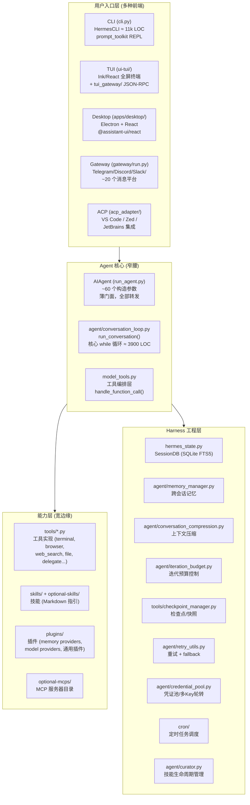
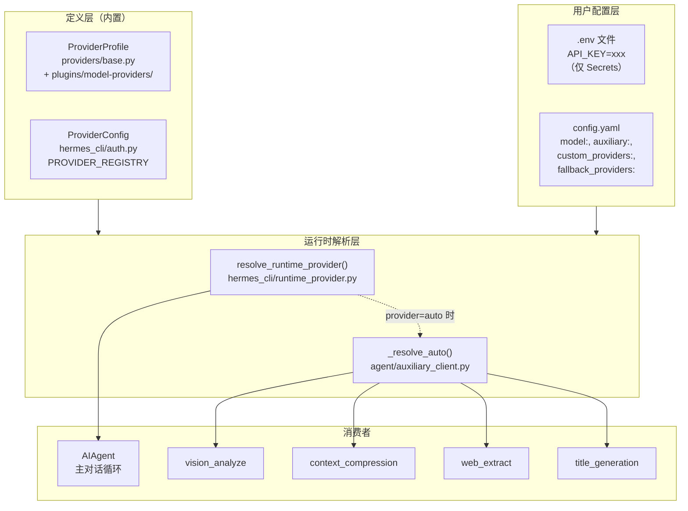

# Hermes Agent 架构分析

> 基于源码 `hermes-agent` (v0.18.0) 的架构解读。

---

## 一、CLI、TUI、Desktop 三种运行模式的入口

### 1. CLI 模式入口

```
用户执行: hermes (或 hermes chat)
    ↓
hermes_cli/main.py:main()         ← argparse 入口，解析子命令
    ↓
cli.py: HermesCLI 类              ← 交互式 REPL，约 11000 行
    ↓ (每轮用户输入)
run_agent.py: AIAgent.run_conversation()  → 转发到 agent/conversation_loop.py
```

- **`hermes_cli/main.py`** — 命令行入口，解析 `hermes chat` / `hermes gateway` / `hermes setup` 等所有子命令。在导入任何 Hermes 模块之前完成 profile override（`_apply_profile_override()`）和 TUI/CLI 模式判定（`_wants_tui_early()`）。
- **`cli.py`** — `HermesCLI` 类，基于 **prompt_toolkit** 构建的交互式 REPL，包含 Rich banner、KawaiiSpinner 动画、皮肤引擎（`hermes_cli/skin_engine.py`）、斜杠命令补全（`hermes_cli/commands.py`）等。

### 2. TUI 模式入口

```
用户执行: hermes --tui (或 HERMES_TUI=1)
    ↓
hermes_cli/main.py 检测 --tui 标志 → 启动两个进程:
    ├── Node.js (ui-tui/)  ← Ink (React) 全屏 TUI
    └── Python (tui_gateway/)  ← JSON-RPC 后端
        二者通过 stdin/stdout 用 newline-delimited JSON-RPC 通信
    ↓
ui-tui/src/entry.tsx            ← Node 侧入口
tui_gateway/server.py           ← Python 侧入口 (JSON-RPC server)
    ↓ (prompt.submit →)
run_agent.py: AIAgent.run_conversation()
```

- **`ui-tui/src/entry.tsx`** — 基于 Ink (React for terminal) 的全屏 TUI 渲染入口，负责终端模式重置、graceful exit、内存监控等。
- **`tui_gateway/server.py`** — JSON-RPC 服务端，管理 session、tools、slash 命令，调用 `AIAgent`。包含崩溃日志（`tui_gateway_crash.log`）和 panic hook。
- **进程模型**：Node 负责屏幕渲染（transcript、composer、activity），Python 负责 session/工具/模型调用。通过 `tui_gateway/transport.py` 的 `StdioTransport` 通信。

### 3. Desktop (Electron) 模式入口

```
用户启动: Hermes Desktop App
    ↓
apps/desktop/electron/main.cjs   ← Electron 主进程
    ↓ (spawn 子进程)
hermes serve (tui_gateway 后端)  ← 无头 JSON-RPC 后端
    ↓ (WebSocket JSON-RPC)
apps/desktop/src/main.tsx        ← React 渲染进程入口
    ↓
@assistant-ui/react 组件         ← 独立聊天 UI (非嵌入 --tui)
    ↓
apps/shared/ JsonRpcGatewayClient ← WebSocket 客户端与后端通信
```

- **`apps/desktop/electron/main.cjs`** — Electron 主进程（窗口管理、spawn 后端、native 能力、自动更新、git 操作等）。
- **`apps/desktop/src/main.tsx`** — React 渲染进程（使用 `@assistant-ui/react` 组件库，**独立于 TUI** 的另一套聊天界面）。
- **`apps/shared/`** — 共享包 `@hermes/shared`，提供 `JsonRpcGatewayClient` 和 WebSocket URL 工具。
- Desktop 复用 `tui_gateway` 作为后端，但前端是完全独立的 React 实现。斜杠命令通过 `apps/desktop/src/lib/desktop-slash-commands.ts` 进行客户端策展后分发到后端。

---

## 二、以 CLI 模式为例，Hermes 整体设计思路

Hermes 的设计核心可以用 AGENTS.md 中的一句话概括：

> **The core is a narrow waist; capability lives at the edges.**



### 设计理念拆解

| 层次 | 职责 | 关键约束 |
|------|------|----------|
| **用户入口层** | 多前端适配（CLI/TUI/Desktop/Gateway/ACP），每个前端有自己的交互范式 | 各自独立，通过 `AIAgent` 统一调用 |
| **核心层（窄腰）** | `run_conversation()` — 唯一的一个 while 循环统一所有前端 | 每轮 API 调用的 prompt **永远不变**（保证 cache 命中）；工具 schema 不变；不添加新核心工具 |
| **能力层（宽边缘）** | 工具(terminal/file/browser/search/delegate)、技能(skills.md)、插件(plugin.yaml)、MCP 服务器 | 通过"脚印阶梯"原则：尽量走 CLI 命令 + skill → service-gated tool → plugin → MCP → **最后才考虑核心工具** |
| **Harness 工程层** | Session 持久化、记忆管理、上下文压缩、预算控制、重试/fallback、凭证池、定时任务、技能策展 | 所有这些对 Agent 循环透明，但都是生产级 AI Agent 必不可少的工程支撑 |

### 两大神圣属性

1. **Per-conversation prompt caching is sacred.** 长对话每轮复用缓存的 prefix。任何修改历史上下文、中途切换 toolset、或重建 system prompt 的操作都会使缓存失效，成倍增加用户成本。唯一的例外是上下文压缩。
2. **The core is a narrow waist; capability lives at the edges.** 每个核心工具都会在每次 API 调用中发送，因此添加新核心工具的门槛极高。大多数新能力应以 CLI 命令 + skill、service-gated tool、或 plugin 的形式出现。

### 脚印阶梯 (The Footprint Ladder)

新能力的决策顺序（从最少脚印到最多）：

1. **扩展现有代码** — 零新表面
2. **CLI 命令 + skill** — 零模型工具脚印（默认选择）
3. **Service-gated tool (`check_fn`)** — 仅在满足前置条件时出现
4. **Plugin** — 第三方/利基/用户特定能力，不随核心发布
5. **MCP 服务器（目录中）** — 零永久核心 schema 脚印
6. **新核心工具** — 仅当能力是基础性的、对几乎所有用户都有用、且无法通过 terminal + file 实现时

---

## 三、Agent 循环的主体实现

Agent 循环的主体在 **`agent/conversation_loop.py`** 的 `run_conversation()` 函数中（约 3900 行），`run_agent.py` 中的 `AIAgent.run_conversation()` 只是一个薄转发器：

```python
# run_agent.py:5692
def run_conversation(self, ...):
    """Forwarder — see agent.conversation_loop.run_conversation."""
    from agent.conversation_loop import run_conversation
    return run_conversation(self, ...)
```

同样，`AIAgent.__init__` 也转发到 `agent/agent_init.py:init_agent()`。

### 核心循环结构

```
build_turn_context()          ← 每轮序幕：stdio 守护、消息清洗、
                                system prompt 构建/恢复、记忆预取、
                                压缩预检、插件 pre_llm_call hook
                                (agent/turn_context.py)

while (api_call_count < max_iterations 
       and budget.remaining > 0) 
       or budget_grace_call:
    │
    ├── 中断检查 (_interrupt_requested)
    ├── 预算消费 (iteration_budget.consume())
    ├── step_callback (gateway agent:step 事件)
    ├── /steer 消息注入 (预 API 调用 drain)
    │
    ├── 构建 api_messages:
    │   ├── 记忆上下文注入 (build_memory_context_block)
    │   ├── reasoning echo (multi-turn 推理保真)
    │   ├── prompt caching 注入 (cache_control 断点)
    │   ├── 消息序列修复 (角色交替违规修复)
    │   ├── thinking-only turn 清理
    │   ├── 消息规范化 (whitespace + JSON key 排序)
    │   └── surrogate 字符清理
    │
    ├── API 调用 (重试循环):
    │   ├── Nous rate limit 守卫 (agent/nous_rate_guard.py)
    │   ├── middleware 链 (hermes_cli/middleware.py)
    │   ├── pre_api_request 插件 hook
    │   ├── streaming 路径 (优先) / 非 streaming 路径
    │   ├── 错误分类 → 重试 / fallback / 压缩 / 中断
    │   │   (agent/error_classifier.py, agent/retry_utils.py)
    │   └── 成功 → assistant_message
    │
    ├── 如有 tool_calls:
    │   ├── execute_tool_calls_concurrent() 或
    │   │   execute_tool_calls_sequential()
    │   │   └── agent/tool_executor.py
    │   ├── 工具结果追加到 messages
    │   └── 继续循环
    │
    └── 如无 tool_calls → 结束循环 (final_response)

finalize_turn()               ← agent/turn_finalizer.py
    ├── 预算耗尽摘要
    ├── trajectory 保存
    ├── session 持久化 (SQLite)
    ├── 内存/技能后台审查触发
    └── 返回 result dict
```

### 关键设计决策

- **同步循环，单线程模型** — 整个 `while` 循环是同步的（虽然有异步工具调用的桥接，通过 `model_tools.py` 中的持久化 event loop）
- **Prompt caching 绝对不可破坏** — system prompt 只构建一次（`_cached_system_prompt`），每轮回放完全相同的字节
- **工具调用支持并发执行** — `execute_tool_calls_concurrent()` 用 `ThreadPoolExecutor` 并行执行独立工具
- **`_budget_grace_call` 机制** — 预算耗尽后给模型"最后一次发言机会"，避免截断
- **消息角色交替严格保证** — 绝不允许两个相同角色的消息连续出现，也绝不在循环中注入合成的 user 消息

---

## 四、围绕 Agent 循环的 Harness 工程

### 4.1 目录总览

| 目录 | 职责 | 关键文件 |
|------|------|----------|
| **`agent/`** | Agent 内部机制（~90 文件） | `conversation_loop.py`, `conversation_compression.py`, `memory_manager.py`, `iteration_budget.py`, `error_classifier.py`, `retry_utils.py`, `credential_pool.py`, `prompt_builder.py`, `prompt_caching.py`, `turn_context.py`, `turn_finalizer.py`, `tool_executor.py` |
| **`tools/`** | 工具实现 + 注册表（~100 文件） | `registry.py`, `terminal_tool.py`, `browser_tool.py`, `delegate_tool.py`, `file_tools.py`, `web_tools.py`, `checkpoint_manager.py` |
| **`gateway/`** | 消息网关（多平台接入） | `run.py`, `session.py`, `hooks.py`, `platforms/*.py` |
| **`tui_gateway/`** | TUI 的 Python JSON-RPC 后端 | `server.py`, `transport.py` |
| **`cron/`** | 定时任务调度 | `jobs.py`, `scheduler.py` |
| **`hermes_cli/`** | CLI 子命令、配置、插件发现 | `main.py`, `config.py`, `plugins.py`, `commands.py` |
| **`hermes_state.py`** | SessionDB — SQLite 会话存储 (FTS5 全文搜索) | — |
| **`model_tools.py`** | 工具编排层（连接 registry 和 agent） | — |
| **`toolsets.py`** | 工具集定义 | — |

### 4.2 按关注点分类的 Harness 组件

#### 🔄 生命周期 & 韧性

| 组件 | 文件 | 功能 |
|------|------|------|
| **Turn Context** | `agent/turn_context.py` | 每轮序幕：stdio 守护、消息清洗、system prompt 恢复/构建、记忆预取、压缩预检 |
| **Turn Finalizer** | `agent/turn_finalizer.py` | 每轮收尾：trajectory 保存、session 持久化、内存/技能审查触发 |
| **Iteration Budget** | `agent/iteration_budget.py` | 线程安全的迭代计数 + `_budget_grace_call` 机制 |
| **Checkpoint Manager** | `tools/checkpoint_manager.py` | 文件级快照/回滚 |
| **Process Bootstrap** | `agent/process_bootstrap.py` | 安全的 stdio 守护 |
| **Cron Scheduler** | `cron/scheduler.py` + `cron/jobs.py` | 定时任务调度（3 分钟硬中断、catchup 窗口、文件锁防重复） |

#### 🔁 重试 & 容错

| 组件 | 文件 | 功能 |
|------|------|------|
| **Error Classifier** | `agent/error_classifier.py` | API 错误分类 → 决定重试/fallback/中断 |
| **Retry Utils** | `agent/retry_utils.py` | 自适应 rate-limit backoff + jitter |
| **Turn Retry State** | `agent/turn_retry_state.py` | 每次 API 调用的重试状态机 |
| **Message Sanitization** | `agent/message_sanitization.py` | 修复 tool_call 参数损坏、消息角色交替违规、non-ASCII/surrogate 清理 |
| **Credential Pool** | `agent/credential_pool.py` + `credential_sources.py` + `credential_persistence.py` | 多 API Key 池、token 刷新、401 自动切换 |
| **Nous Rate Guard** | `agent/nous_rate_guard.py` | 跨 session 的 rate limit 感知 |

#### 📦 上下文管理

| 组件 | 文件 | 功能 |
|------|------|------|
| **Conversation Compression** | `agent/conversation_compression.py` | LLM 驱动的对话历史摘要压缩 |
| **Context Compressor** | `agent/context_compressor.py` | 上下文引擎接口 |
| **Context Engine** | `agent/context_engine.py` | 可插拔的上下文引擎（插件体系） |
| **Context Breakdown** | `agent/context_breakdown.py` | 上下文分解/分析 |
| **Model Metadata** | `agent/model_metadata.py` | token 估算、context length 检测 |
| **Prompt Caching** | `agent/prompt_caching.py` | Anthropic 风格的 `cache_control` 断点注入（节省 ~75% 输入成本） |
| **Prompt Builder** | `agent/prompt_builder.py` | System prompt 构建和缓存 |

#### 🧠 记忆 & 学习

| 组件 | 文件 | 功能 |
|------|------|------|
| **Memory Manager** | `agent/memory_manager.py` | 记忆提供者的编排层 |
| **Memory Provider ABC** | `agent/memory_provider.py` | 可插拔记忆后端（honcho/mem0/supermemory 等） |
| **Session DB** | `hermes_state.py` | SQLite + FTS5 全文搜索的会话存储 |
| **Skill Usage** | `tools/skill_usage.py` | 技能使用追踪（`.usage.json`） |
| **Curator** | `agent/curator.py` + `curator_backup.py` | 技能生命周期：自动归档、备份、恢复 |
| **Background Review** | `agent/background_review.py` | 后台审查触发 |

#### 🛠 工具执行

| 组件 | 文件 | 功能 |
|------|------|------|
| **Tool Executor** | `agent/tool_executor.py` | 并行/串行工具调用执行器 |
| **Tool Dispatch Helpers** | `agent/tool_dispatch_helpers.py` | 工具分发辅助 |
| **Tool Guardrails** | `agent/tool_guardrails.py` | 工具调用护栏 |
| **Tool Result Classification** | `agent/tool_result_classification.py` | 工具结果分类 |
| **Delegation** | `tools/delegate_tool.py` | 子 Agent 生成（单任务/批量并行） |

#### 🌐 多前端支持

| 组件 | 文件 | 功能 |
|------|------|------|
| **Gateway Run** | `gateway/run.py` | 消息网关主循环（Telegram/Discord/Slack 等 ~20 平台） |
| **Gateway Session** | `gateway/session.py` | 网关会话管理 |
| **Gateway Hooks** | `gateway/hooks.py` | 生命周期钩子 |
| **TUI Gateway** | `tui_gateway/server.py` | JSON-RPC 服务端 |
| **ACP Adapter** | `acp_adapter/server.py` | VS Code/Zed/JetBrains 编辑器集成 |

#### 💰 成本 & 用量

| 组件 | 文件 | 功能 |
|------|------|------|
| **Usage Pricing** | `agent/usage_pricing.py` | 用量成本估算 |
| **Account Usage** | `agent/account_usage.py` | 账户用量追踪 |
| **Credits Tracker** | `agent/credits_tracker.py` | 积分追踪 |
| **Billing View** | `agent/billing_view.py` | 账单视图 |

### 4.3 数据流全景

```
用户输入 (CLI / TUI / Desktop / Gateway / ACP)
    │
    ▼
┌─────────────────────────────────────────────────────────┐
│  turn_context.py: build_turn_context()                   │
│  ├── stdio 守护 (process_bootstrap)                     │
│  ├── 消息清洗 (message_sanitization)                    │
│  ├── system prompt 恢复/构建 (prompt_builder)           │
│  ├── 压缩预检 (conversation_compression)                │
│  ├── 记忆预取 (memory_manager)                          │
│  └── pre_llm_call 插件 hook                             │
└────────────────────────┬────────────────────────────────┘
                         ▼
┌─────────────────────────────────────────────────────────┐
│  conversation_loop.py: run_conversation() while 循环     │
│  ┌─ 中断检查 ── 预算消费 ── step_callback ── steer注入  │
│  ├─ 构建 api_messages:                                   │
│  │   ├── 记忆上下文注入                                  │
│  │   ├── reasoning echo (multi-turn 推理保真)            │
│  │   ├── prompt caching 注入 (cache_control 断点)        │
│  │   ├── 消息序列修复 (角色交替)                         │
│  │   └── token 估算 + Ollama 上下文检查                  │
│  ├─ API 调用 (重试循环):                                  │
│  │   ├── rate limit 守卫 (nous_rate_guard)               │
│  │   ├── middleware 链 (hermes_cli/middleware)            │
│  │   ├── pre_api_request 插件 hook                       │
│  │   ├── streaming / non-streaming                       │
│  │   └── 错误分类 → 重试 / fallback / 压缩 / 中断        │
│  └─ 有 tool_calls → tool_executor.py (并发/串行)        │
│      └── model_tools.handle_function_call() → registry   │
└────────────────────────┬────────────────────────────────┘
                         ▼
┌─────────────────────────────────────────────────────────┐
│  turn_finalizer.py: finalize_turn()                      │
│  ├── trajectory 保存                                     │
│  ├── session 持久化 → hermes_state.py (SQLite FTS5)      │
│  ├── 内存后台审查触发 (memory_manager)                   │
│  ├── 技能使用追踪 (skill_usage)                           │
│  └── 返回 result dict                                    │
└─────────────────────────────────────────────────────────┘
                         │
                         ▼
                    返回给前端
```

---

## 五、关键文件依赖链

```
tools/registry.py  (无依赖 — 被所有工具文件导入)
       ↑
tools/*.py  (每个文件在 import 时调用 registry.register())
       ↑
model_tools.py  (导入 tools/registry + 触发工具发现)
       ↑
run_agent.py, cli.py, batch_runner.py, environments/
       ↑
agent/conversation_loop.py  (核心 while 循环)
       ↑
agent/turn_context.py, agent/turn_finalizer.py, agent/tool_executor.py
```

---

## 六、核心设计原则总结

1. **窄腰宽边** — 核心 Agent 循环是唯一窄腰，所有前端通过它驱动，所有能力在边缘扩展
2. **Prompt 缓存神圣不可侵犯** — system prompt 字节级稳定，绝不中途修改
3. **消息角色严格交替** — 绝不允许两个相同角色消息连续出现
4. **工具脚印最小化** — 新能力优先走 CLI+skill → plugin → MCP，核心工具是最后手段
5. **配置分离** — `.env` 仅存密钥，`config.yaml` 存所有行为设置
6. **Profile 隔离** — 多实例通过 `HERMES_HOME` 完全隔离，使用 `get_hermes_home()` 而非硬编码 `~/.hermes`
7. **依赖精确锁定** — 所有依赖使用 `==X.Y.Z` 精确版本，防止供应链攻击
8. **同步核心，异步桥接** — Agent 循环是同步的，异步工具通过持久化 event loop 桥接


-----------------------------------------------------------------------
# Hermes配置

参考官方文档：
- [Using Hermes | Configuration](https://hermes-agent.nousresearch.com/docs/user-guide/configuration): 整体配置文件概览
- [Using Hermes | Configuring Models](https://hermes-agent.nousresearch.com/docs/user-guide/configuring-models): 主模型/辅助模型配置指南
- [Integrations | AI Providers](https://hermes-agent.nousresearch.com/docs/integrations/providers): 模型集成
- [Reference | Configuration Reference | Environment Variables](https://hermes-agent.nousresearch.com/docs/reference/environment-variables): 环境变量参考手册，均可在`.env`文件使用。


Hermes配置文件主要是两类：
- `~/.hermes/config.yaml`: 模板文件为`cli-config.yaml.example`，主配置文件，用于存放非secrets配置。
- `~/.hermes/.env`: 模板文件为`.env.example`，用于存放环境变量，主要是API-KEY等secrets配置。

此外，命令行参数可以覆盖上述配置。

## 模型配置

### 一、LLM 模型配置加载机制全景

Hermes 的模型配置加载是一个多层级的解析链，涉及如下五个层次：
```text
ProviderProfile（模型提供商定义）
 → ProviderConfig（认证配置） 
 → config.yaml（主配置） 
 → .env（密钥） 
 → 运行时解析（runtime_provider）
```

下面从 `hermes_cli/main.py` 的启动流程出发，逐层分析。

#### 1.1 启动入口：配置加载的触发点

在 `hermes_cli/main.py:main()` 中，启动流程按以下顺序加载配置：

```
main()
  ├── _apply_profile_override()     ← 解析 -p/--profile 设置 HERMES_HOME
  ├── load_hermes_dotenv()          ← 加载 ~/.hermes/.env 到 os.environ
  ├── _setup_logging()              ← 初始化日志
  └── cmd_chat(args)                ← 进入聊天
        ├── _has_any_provider_configured()  ← 检测是否有可用提供商
        ├── cmd_chat → cli_main()           ← 启动 CLI REPL
        │     └── AIAgent.__init__()
        │           └── agent/agent_init.py:init_agent()
        │                 └── resolve_runtime_provider()  ← ★ 核心解析入口
        └── 或 _launch_tui()                 ← 启动 TUI
```

关键点：
- `.env` 文件在 `main()` 中通过 `load_hermes_dotenv()` 最早加载，将 API Key 等环境变量注入 `os.environ`
- `config.yaml` 通过 `load_config()` 懒加载，首次调用时从 `~/.hermes/config.yaml` 读取并缓存
- 模型提供商的最终解析发生在 `agent/agent_init.py:init_agent()` → `hermes_cli/runtime_provider.py:resolve_runtime_provider()`

#### 1.2 两层注册表：ProviderProfile + ProviderConfig

Hermes 有两层互补的提供商注册表：

**第一层：`ProviderProfile`（`providers/` + `plugins/model-providers/`）**

这是**声明式**的提供商元数据，定义在 `providers/base.py` 的 `ProviderProfile` dataclass 中：

```python
@dataclass
class ProviderProfile:
    name: str                        # 提供商标识符，如 "deepseek"
    api_mode: str = "chat_completions"  # API 模式
    aliases: tuple = ()              # 别名，如 ("deepseek-chat",)
    env_vars: tuple = ()             # 需要的环境变量，如 ("DEEPSEEK_API_KEY",)
    base_url: str = ""               # 默认 API 端点
    auth_type: str = "api_key"       # 认证类型
    display_name: str = ""           # 显示名称
    fallback_models: tuple = ()      # 回退模型列表
    # ... 以及 prepare_messages(), build_extra_body(), build_api_kwargs_extras() 等钩子
```

每个内置提供商在 `plugins/model-providers/<name>/__init__.py` 中实例化并注册。例如 DeepSeek：

```python
# plugins/model-providers/deepseek/__init__.py
deepseek = DeepSeekProfile(
    name="deepseek",
    aliases=("deepseek-chat",),
    env_vars=("DEEPSEEK_API_KEY",),
    base_url="https://api.deepseek.com/v1",
    # ...
)
register_provider(deepseek)
```

**发现机制**：`providers/__init__.py:_discover_providers()` 在首次调用 `get_provider_profile()` 或 `list_providers()` 时懒加载：
1. 扫描 `<repo>/plugins/model-providers/<name>/`（内置插件）
2. 扫描 `$HERMES_HOME/plugins/model-providers/<name>/`（用户插件，可覆盖内置）
3. 扫描 `providers/<name>.py`（旧版单文件，向后兼容）

**第二层：`ProviderConfig`（`hermes_cli/auth.py`）**

这是**认证层面**的提供商配置，定义在 `hermes_cli/auth.py:PROVIDER_REGISTRY` 字典中：

```python
PROVIDER_REGISTRY = {
    "deepseek": ProviderConfig(
        id="deepseek",
        name="DeepSeek",
        auth_type="api_key",
        inference_base_url="https://api.deepseek.com/v1",
        api_key_env_vars=("DEEPSEEK_API_KEY",),
        base_url_env_var="DEEPSEEK_BASE_URL",
    ),
    "openrouter": ProviderConfig(
        id="openrouter",
        name="OpenRouter",
        auth_type="api_key",
        inference_base_url="https://openrouter.ai/api/v1",
        api_key_env_vars=("OPENROUTER_API_KEY", "OPENAI_API_KEY"),
        base_url_env_var="OPENROUTER_BASE_URL",
    ),
    # ... 30+ 提供商
}
```

此外，`auth.py` 还会自动从 `ProviderProfile` 注册表扩展 `PROVIDER_REGISTRY`（`_auto_extend_provider_registry_from_profiles()`），使得在 `plugins/model-providers/` 中新增的提供商无需修改 `auth.py` 即可被识别。

**两层的关系**：
- `ProviderProfile` 负责**传输层行为**（消息预处理、extra_body 构建、API 模式选择）
- `ProviderConfig` 负责**认证层行为**（API Key 环境变量名、OAuth 流程、Base URL 覆盖）
- 运行时通过 `resolve_runtime_provider()` 将两者合并为最终的 `{provider, api_key, base_url, api_mode}` 字典

#### 1.3 运行时解析核心：`resolve_runtime_provider()`

`hermes_cli/runtime_provider.py:resolve_runtime_provider()` 是模型配置加载的**最终仲裁者**，约 2000 行，解析顺序如下：

```
resolve_runtime_provider(requested, explicit_api_key, explicit_base_url)
  │
  ├── 1. resolve_requested_provider() → 确定 provider ID
  │      ├── 命令行 --provider 标志
  │      ├── config.yaml model.provider
  │      └── "auto" → 自动检测
  │
  ├── 2. 特殊提供商短路
  │      ├── "moa" → 虚拟 MoA 提供商
  │      ├── "azure-foundry" → Azure Foundry 端点
  │      └── "vertex" → GCP Vertex AI (OAuth2 token)
  │
  ├── 3. _resolve_named_custom_runtime()
  │      └── 检查 config.yaml custom_providers[] 中的命名自定义提供商
  │
  ├── 4. resolve_provider("auto") 自动检测链
  │      ├── 显式 CLI api_key/base_url → "openrouter"
  │      ├── config.yaml model.provider
  │      ├── OPENAI_API_KEY / OPENROUTER_API_KEY 环境变量
  │      ├── OpenRouter 凭证池
  │      ├── 遍历 PROVIDER_REGISTRY 中每个 api_key 提供商的 env vars
  │      └── auth.json active_provider (OAuth 登录)
  │
  ├── 5. _resolve_explicit_runtime() → 按提供商类型分发
  │      ├── "openrouter" → _resolve_openrouter_runtime()
  │      ├── "nous" → resolve_nous_runtime_credentials()
  │      ├── "anthropic" → resolve_api_key_provider_credentials()
  │      ├── "openai-codex" → resolve_codex_runtime_credentials()
  │      ├── "copilot" → resolve_api_key_provider_credentials()
  │      └── 其他 → resolve_api_key_provider_credentials()
  │
  └── 6. 返回 {provider, api_mode, base_url, api_key, source, ...}
```

#### 1.4 配置优先级总结

从高到低：

| 优先级 | 来源 | 说明 |
|--------|------|------|
| 1 | 命令行参数 | `--provider`, `--model`, `--api-key`, `--base-url` |
| 2 | 环境变量 | `os.environ`（含 `.env` 文件加载的值） |
| 3 | `config.yaml` | `model.provider`, `model.default`, `model.base_url`, `model.api_key` |
| 4 | `auth.json` | OAuth 登录后的 `active_provider` |
| 5 | 自动检测 | 扫描各提供商的 API Key 环境变量 |
| 6 | 默认值 | `DEFAULT_CONFIG` 中 `model: ""` (空字符串 = auto) |

---

### 二、不同模型提供商的环境变量

**不同模型提供商使用不同的环境变量名。** 这些变量名在两个地方内置定义：

#### 2.1 `ProviderProfile.env_vars`

这是**声明式定义**，源码文件为`plugins/model-providers/<name>/__init__.py`，描述提供商需要哪些环境变量：

| 提供商 | 环境变量 | 定义位置 |
|--------|---------|---------|
| DeepSeek | `DEEPSEEK_API_KEY` | `plugins/model-providers/deepseek/__init__.py` |
| OpenRouter | `OPENROUTER_API_KEY` | `plugins/model-providers/openrouter/__init__.py` |
| Anthropic | `ANTHROPIC_API_KEY`, `ANTHROPIC_TOKEN`, `CLAUDE_CODE_OAUTH_TOKEN` | `plugins/model-providers/anthropic/__init__.py` |
| Novita | `NOVITA_API_KEY` | `plugins/model-providers/novita/__init__.py` |
| NVIDIA | `NVIDIA_API_KEY` | `plugins/model-providers/nvidia/__init__.py` |

#### 2.2 `ProviderConfig.api_key_env_vars`

这是**认证层面的定义**，源码文件`hermes_cli/auth.py:PROVIDER_REGISTRY`，支持多个回退环境变量：

```python
PROVIDER_REGISTRY = {
    "openrouter": ProviderConfig(
        api_key_env_vars=("OPENROUTER_API_KEY", "OPENAI_API_KEY"),  # 两个回退
    ),
    "gemini": ProviderConfig(
        api_key_env_vars=("GOOGLE_API_KEY", "GEMINI_API_KEY"),      # 两个回退
    ),
    "zai": ProviderConfig(
        api_key_env_vars=("GLM_API_KEY", "ZAI_API_KEY", "Z_AI_API_KEY"),  # 三个回退
    ),
    "copilot": ProviderConfig(
        api_key_env_vars=("COPILOT_GITHUB_TOKEN", "GH_TOKEN", "GITHUB_TOKEN"),
    ),
    "anthropic": ProviderConfig(
        api_key_env_vars=("ANTHROPIC_API_KEY", "ANTHROPIC_TOKEN", "CLAUDE_CODE_OAUTH_TOKEN"),
    ),
    # ... 每个提供商都有独立的 api_key_env_vars
}
```

#### 2.3 完整环境变量映射表

| 提供商 ID | API Key 环境变量 | Base URL 环境变量 |
|-----------|-----------------|-------------------|
| `openrouter` | `OPENROUTER_API_KEY`, `OPENAI_API_KEY` | `OPENROUTER_BASE_URL` |
| `anthropic` | `ANTHROPIC_API_KEY`, `ANTHROPIC_TOKEN`, `CLAUDE_CODE_OAUTH_TOKEN` | `ANTHROPIC_BASE_URL` |
| `gemini` | `GOOGLE_API_KEY`, `GEMINI_API_KEY` | `GEMINI_BASE_URL` |
| `deepseek` | `DEEPSEEK_API_KEY` | `DEEPSEEK_BASE_URL` |
| `zai` | `GLM_API_KEY`, `ZAI_API_KEY`, `Z_AI_API_KEY` | `GLM_BASE_URL` |
| `kimi-coding` | `KIMI_API_KEY`, `KIMI_CODING_API_KEY` | `KIMI_BASE_URL` |
| `kimi-coding-cn` | `KIMI_CN_API_KEY` | — |
| `minimax` | `MINIMAX_API_KEY` | `MINIMAX_BASE_URL` |
| `minimax-cn` | `MINIMAX_CN_API_KEY` | `MINIMAX_CN_BASE_URL` |
| `xai` | `XAI_API_KEY` | `XAI_BASE_URL` |
| `alibaba` | `DASHSCOPE_API_KEY` | `DASHSCOPE_BASE_URL` |
| `nvidia` | `NVIDIA_API_KEY` | `NVIDIA_BASE_URL` |
| `huggingface` | `HF_TOKEN` | `HF_BASE_URL` |
| `xiaomi` | `XIAOMI_API_KEY` | `XIAOMI_BASE_URL` |
| `gmi` | `GMI_API_KEY` | `GMI_BASE_URL` |
| `stepfun` | `STEPFUN_API_KEY` | `STEPFUN_BASE_URL` |
| `arcee` | `ARCEEAI_API_KEY` | `ARCEE_BASE_URL` |
| `novita` | `NOVITA_API_KEY` | `NOVITA_BASE_URL` |
| `copilot` | `COPILOT_GITHUB_TOKEN`, `GH_TOKEN`, `GITHUB_TOKEN` | `COPILOT_API_BASE_URL` |
| `ollama-cloud` | `OLLAMA_API_KEY` | `OLLAMA_BASE_URL` |
| `kilocode` | `KILOCODE_API_KEY` | `KILOCODE_BASE_URL` |
| `opencode-zen` | `OPENCODE_ZEN_API_KEY` | `OPENCODE_ZEN_BASE_URL` |
| `tencent-tokenhub` | `TOKENHUB_API_KEY` | `TOKENHUB_BASE_URL` |
| `azure-foundry` | `AZURE_FOUNDRY_API_KEY` | `AZURE_FOUNDRY_BASE_URL` |
| `bedrock` | (使用 AWS SDK 凭据链) | `BEDROCK_BASE_URL` |
| `lmstudio` | `LM_API_KEY`（可选） | `LM_BASE_URL` |

---

### 三、配置方式

API_KEY 和 BASE_URL 在 config.yaml / .env 中的配置方式如下。

#### 3.1 `.env` 文件 — 仅存放 Secrets

`.env` 文件遵循 **"`.env` is for secrets only"** 原则。

所有 API Key、Token、密码存放在此：

```bash
# ~/.hermes/.env
# 推荐方式：OpenRouter（聚合 300+ 模型）
OPENROUTER_API_KEY=sk-or-v1-xxxx

# 或者直连提供商
DEEPSEEK_API_KEY=sk-xxxx
ANTHROPIC_API_KEY=sk-ant-xxxx
GOOGLE_API_KEY=AIzaxxxx
DASHSCOPE_API_KEY=sk-xxxx

# 自定义端点的 Base URL（可选覆盖）
OPENROUTER_BASE_URL=https://my-proxy.example.com/api/v1
```

`.env` 的加载发生在 `hermes_cli/main.py:_apply_profile_override()` 之后：

```python
# hermes_cli/main.py
from hermes_cli.env_loader import load_hermes_dotenv
load_hermes_dotenv(project_env=PROJECT_ROOT / ".env")
```

读取优先级：`os.environ` > `.env` 文件（通过 `get_env_value()` 和 `get_env_value_prefer_dotenv()` 控制）。

#### 3.2 `config.yaml` — 存放所有非 Secrets 配置

`config.yaml` 是模型和端点配置的**唯一来源**（官方文档明确指出 `.env` 中的 `OPENAI_BASE_URL` 和 `LLM_MODEL` 已被移除）。

**主模型配置：**

```yaml
# ~/.hermes/config.yaml
model:
  provider: "openrouter"                   # 提供商 ID
  default: "anthropic/claude-opus-4.6"     # 默认模型（也支持 "model" 作为键名）
  base_url: "https://openrouter.ai/api/v1" # API 端点（切换提供商时自动清除）
  api_key: ""                              # 可选：直接写在 config 中（不推荐，应用 .env）
  api_mode: "chat_completions"             # API 模式（chat_completions / anthropic_messages）
  context_length: 131072                   # 可选：手动覆盖上下文窗口
  max_tokens: 8192                         # 可选：输出 token 上限
```

**命名自定义提供商（多个端点）：**

```yaml
# ~/.hermes/config.yaml
custom_providers:
  - name: "together"
    base_url: "https://api.together.xyz/v1"
    key_env: "TOGETHER_API_KEY"          # 引用 .env 中的环境变量名
    models:
      qwen3.5:27b:
        context_length: 32768

  - name: "local"
    base_url: "http://localhost:11434/v1"
    # api_key 省略 → Hermes 使用 "no-key-required" 模式

model:
  provider: "custom:together"            # 使用命名自定义提供商
  default: "MiniMaxAI/MiniMax-M2.7"
```

**Ollama / vLLM / 本地模型：**

```yaml
# ~/.hermes/config.yaml
model:
  default: "qwen2.5-coder:32b"
  provider: "custom"
  base_url: "http://localhost:11434/v1"
  context_length: 32768                   # 重要：覆盖 Ollama 默认的小上下文窗口
```

**OpenRouter 提供商路由：**

```yaml
# ~/.hermes/config.yaml
provider_routing:
  sort: "throughput"                      # price / throughput / latency
  only: ["anthropic"]                     # 仅使用这些提供商
  ignore: ["deepinfra"]                   # 跳过这些提供商
  require_parameters: true                # 仅使用支持所有参数的提供商
```

**故障转移链：**

```yaml
# ~/.hermes/config.yaml
fallback_providers:
  - provider: "openrouter"
    model: "anthropic/claude-sonnet-4"
  - provider: "anthropic"
    model: "claude-sonnet-4"
  - provider: "deepseek"
    model: "deepseek-chat"
```

#### 3.3 配置的读取路径

```python
# hermes_cli/config.py
def load_config() -> Dict[str, Any]:
    """从 ~/.hermes/config.yaml 加载，与 DEFAULT_CONFIG 深度合并，缓存结果。"""
    # 缓存键 = (path, mtime_ns, size)，文件未变时返回缓存副本
    ...

def get_env_value(key: str) -> Optional[str]:
    """先查 os.environ，再查 .env 文件。"""
    ...

def get_env_value_prefer_dotenv(key: str) -> Optional[str]:
    """优先 .env 文件（用于凭证轮转场景，防止 shell 中的旧值覆盖）。"""
    ...
```

---

### 四、主模型 / 辅助（副）模型的配置

Hermes 使用**两类模型槽位**：

| 类型 | 用途 | 配置路径 |
|------|------|----------|
| **主模型 (Main)** | Agent 的思考核心，处理每条用户消息、工具调用循环、流式响应 | `config.yaml` → `model:` |
| **辅助模型 (Auxiliary)** | 边缘任务：视觉分析、网页摘要、上下文压缩、审批、标题生成等 11 个槽位 | `config.yaml` → `auxiliary:` |

#### 4.1 主模型配置

```yaml
# ~/.hermes/config.yaml
model:
  provider: "openrouter"
  default: "anthropic/claude-opus-4.7"
  base_url: ""
  api_mode: "chat_completions"
```

也可以通过以下方式配置：
- **`hermes model`** 交互式向导（终端中运行，非会话内）
- **`/model`** 斜杠命令（会话内热切换）
- **仪表板** → Models 页面 → Change 按钮

#### 4.2 辅助模型配置

辅助模型默认全部为 `auto`，即使用主模型。

可以在 `config.yaml` 中按任务覆盖：

```yaml
# ~/.hermes/config.yaml
auxiliary:
  # 视觉分析（图片/截图）
  vision:
    provider: "openrouter"
    model: "google/gemini-2.5-flash"
    timeout: 30
    download_timeout: 30

  # 上下文压缩
  compression:
    provider: "openrouter"
    model: "google/gemini-3-flash-preview"

  # 网页提取/摘要
  web_extract:
    provider: "auto"      # 使用主模型
    model: ""

  # 智能审批
  approval:
    provider: "openrouter"
    model: "openai/gpt-5-mini"

  # 会话标题生成
  title_generation:
    provider: "openrouter"
    model: "google/gemini-3-flash-preview"

  # MCP 工具路由
  mcp:
    provider: "auto"
    model: ""

  # 技能搜索
  skills_hub:
    provider: "auto"
    model: ""

  # TTS 音频标签
  tts_audio_tags:
    provider: "auto"
    model: ""

  # Kanban 相关
  triage_specifier:
    provider: "auto"
    model: ""
  kanban_decomposer:
    provider: "auto"
    model: ""

  # 自动 Profile 描述
  profile_describer:
    provider: "auto"
    model: ""

  # 技能策展审查
  curator:
    provider: "auto"
    model: ""
```

#### 4.3 辅助模型的 `auto` 解析链

当 `auxiliary.<task>.provider: "auto"` 时，`agent/auxiliary_client.py:_resolve_auto()` 按以下顺序解析：

```
Step 1: 使用主模型的 provider + model（最优先）
  └── 如果主提供商被 402 标记为 unhealthy，跳过

Step 2: 用户配置的 fallback 链
  └── 检查 fallback_providers / fallback_model

Step 3: 硬编码的提供商发现链（文本任务）
  ├── OpenRouter (OPENROUTER_API_KEY)
  ├── Nous Portal (auth.json)
  ├── Custom endpoint (config.yaml model.base_url)
  ├── Native Anthropic
  └── 直接 API-key 提供商 (z.ai/GLM, Kimi, MiniMax...)

Step 3-视觉: 硬编码的提供商发现链（视觉任务）
  ├── 主提供商（如果支持视觉）
  ├── OpenRouter
  ├── Nous Portal
  ├── Native Anthropic
  └── Custom endpoint（本地视觉模型）
```

#### 4.4 常见辅助模型覆盖模式

| 任务 | 推荐配置 | 原因 |
|------|---------|------|
| Title Gen | `gemini-3-flash-preview` | $0.10/M tokens，效果与 Opus 相当 |
| Vision | `gemini-2.5-flash` 或 `gpt-4o-mini` | 主模型是不支持视觉的编程模型时需要 |
| Compression | 快速 chat 模型 | 以 1/50 成本完成摘要 |
| Approval | `haiku` / `flash` / `gpt-5-mini` | 审批不需要推理能力 |
| Web Extract | 同 Compression | 摘要任务不需要推理 |

---

### 五、配置架构总结



**核心设计原则**：
1. 两层注册表分离关注点：`ProviderProfile` 管传输行为，`ProviderConfig` 管认证凭据
2. `.env` 仅存密钥：API Key 绝不写入 `config.yaml`（虽然技术上支持 `model.api_key` 字段）
3. `config.yaml` 是模型配置的**唯一来源**：`OPENAI_BASE_URL` 等旧版环境变量已被移除
4. 懒加载 + 缓存：提供商发现和配置读取都是懒加载的，首次使用后缓存
5. 多级回退链：辅助模型在 `auto` 模式下有完整的 fallback 链，确保即使主提供商不可用也能降级工作

